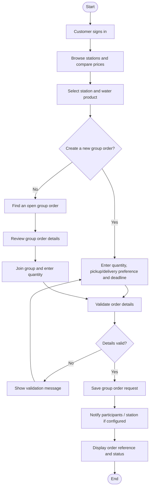

# 4. Activity Diagram — Create a Group Order

```mermaid
flowchart TD
    A([Start]) --> B[Customer signs in]
    B --> C[Browse stations and compare prices]
    C --> D[Select station and water product]
    D --> E{Create a new group order?}
    E -->|Yes| F[Enter quantity, pickup/delivery preference and deadline]
    E -->|No| G[Find an open group order]
    G --> H[Review group order details]
    H --> I[Join group and enter quantity]
    F --> J[Validate order details]
    I --> J
    J --> K{Details valid?}
    K -->|No| L[Show validation message]
    L --> F
    K -->|Yes| M[Save group order request]
    M --> N[Notify participants / station if configured]
    N --> O[Display order reference and status]
    O --> P([End])
```
