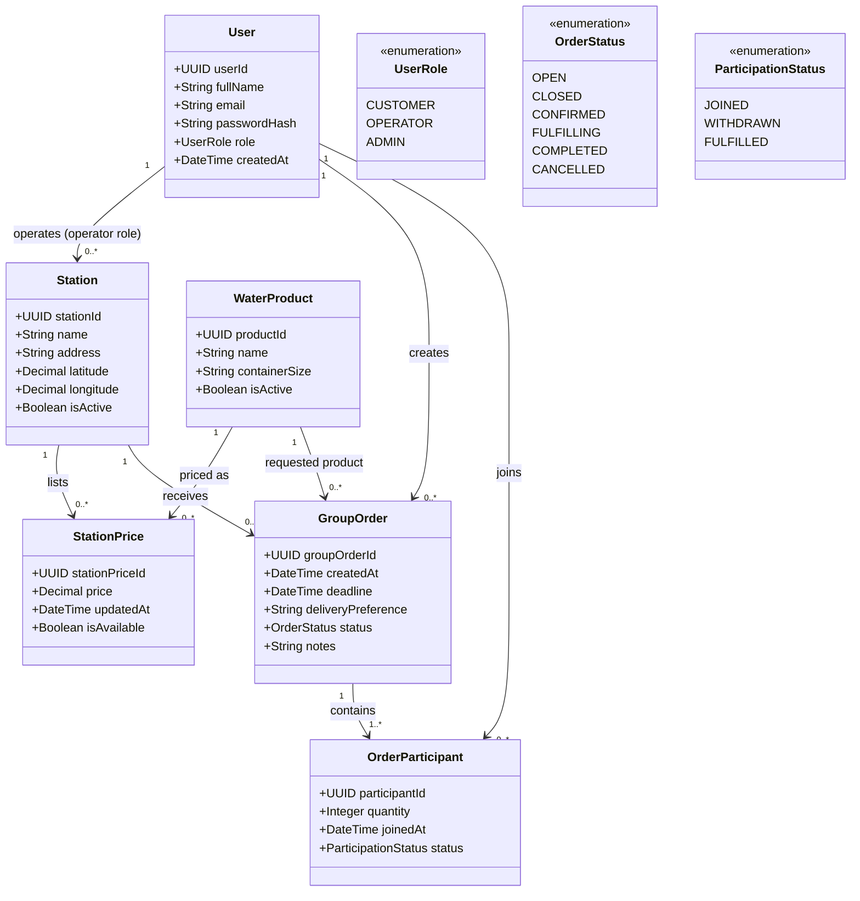

# 6. Class Diagram — Water Watch

```mermaid
classDiagram
    class User {
      +UUID userId
      +String fullName
      +String email
      +String passwordHash
      +UserRole role
      +DateTime createdAt
    }
    class Station {
      +UUID stationId
      +String name
      +String address
      +Decimal latitude
      +Decimal longitude
      +Boolean isActive
    }
    class WaterProduct {
      +UUID productId
      +String name
      +String containerSize
      +Boolean isActive
    }
    class StationPrice {
      +UUID stationPriceId
      +Decimal price
      +DateTime updatedAt
      +Boolean isAvailable
    }
    class GroupOrder {
      +UUID groupOrderId
      +DateTime createdAt
      +DateTime deadline
      +String deliveryPreference
      +OrderStatus status
      +String notes
    }
    class OrderParticipant {
      +UUID participantId
      +Integer quantity
      +DateTime joinedAt
      +ParticipationStatus status
    }
    class UserRole {
      <<enumeration>>
      CUSTOMER
      OPERATOR
      ADMIN
    }
    class OrderStatus {
      <<enumeration>>
      OPEN
      CLOSED
      CONFIRMED
      FULFILLING
      COMPLETED
      CANCELLED
    }
    class ParticipationStatus {
      <<enumeration>>
      JOINED
      WITHDRAWN
      FULFILLED
    }

    User "1" --> "0..*" Station : operates (operator role)
    Station "1" --> "0..*" StationPrice : lists
    WaterProduct "1" --> "0..*" StationPrice : priced as
    User "1" --> "0..*" GroupOrder : creates
    Station "1" --> "0..*" GroupOrder : receives
    WaterProduct "1" --> "0..*" GroupOrder : requested product
    GroupOrder "1" --> "1..*" OrderParticipant : contains
    User "1" --> "0..*" OrderParticipant : joins
```
