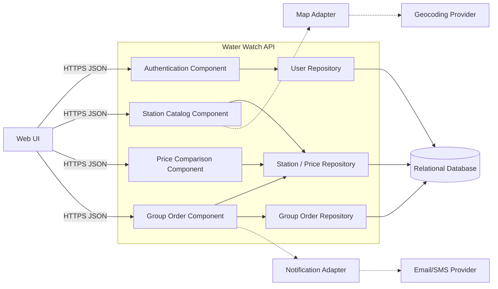

# 9. UML Component Diagram — Water Watch API

```mermaid
flowchart LR
    web[Web UI]
    subgraph API[Water Watch API]
      auth[Authentication Component]
      catalog[Station Catalog Component]
      compare[Price Comparison Component]
      group[Group Order Component]
      userrepo[User Repository]
      stationrepo[Station / Price Repository]
      orderrepo[Group Order Repository]
    end
    db[(Relational Database)]
    notify[Notification Adapter]
    sms[Email/SMS Provider]
    map[Map Adapter]
    mapsvc[Geocoding Provider]

    web -->|HTTPS JSON| auth
    web -->|HTTPS JSON| catalog
    web -->|HTTPS JSON| compare
    web -->|HTTPS JSON| group
    auth --> userrepo
    catalog --> stationrepo
    compare --> stationrepo
    group --> stationrepo
    group --> orderrepo
    userrepo --> db
    stationrepo --> db
    orderrepo --> db
    group -.-> notify
    notify -.-> sms
    catalog -.-> map
    map -.-> mapsvc
```
