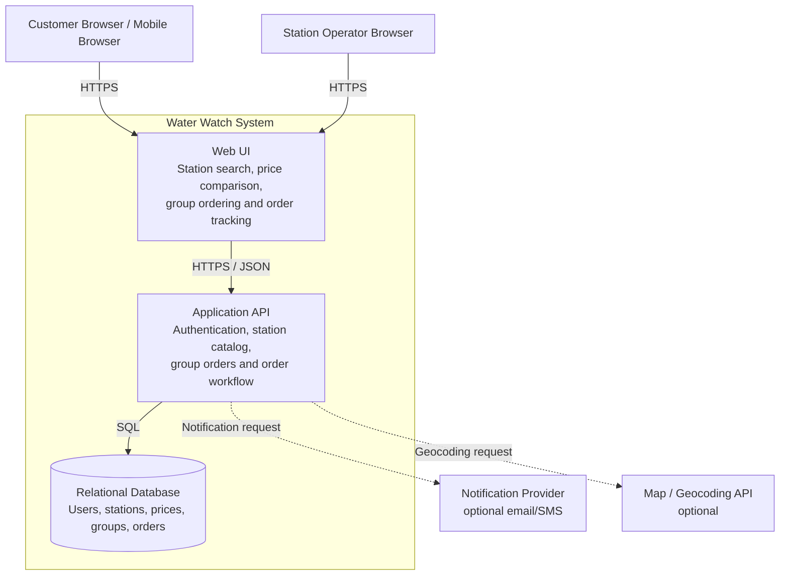

# 2. C4 Container Diagram — Water Watch

```mermaid
flowchart TB
    customer[Customer Browser / Mobile Browser]
    operator[Station Operator Browser]
    subgraph WW[Water Watch System]
      ui[Web UI\nStation search, price comparison,\ngroup ordering and order tracking]
      api[Application API\nAuthentication, station catalog,\ngroup orders and order workflow]
      db[(Relational Database\nUsers, stations, prices, groups, orders)]
    end
    notify[Notification Provider\noptional email/SMS]
    map[Map / Geocoding API\noptional]

    customer -->|HTTPS| ui
    operator -->|HTTPS| ui
    ui -->|HTTPS / JSON| api
    api -->|SQL| db
    api -.->|Notification request| notify
    api -.->|Geocoding request| map
```
