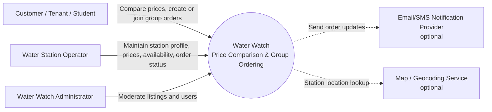

# 1. C4 System Context Diagram — Water Watch

```mermaid
flowchart LR
    customer[Customer / Tenant / Student]
    operator[Water Station Operator]
    admin[Water Watch Administrator]
    app((Water Watch\nPrice Comparison & Group Ordering))
    sms[Email/SMS Notification Provider\noptional]
    maps[Map / Geocoding Service\noptional]

    customer -->|Compare prices, create or join group orders| app
    operator -->|Maintain station profile, prices, availability, order status| app
    admin -->|Moderate listings and users| app
    app -.->|Send order updates| sms
    app -.->|Station location lookup| maps
```
