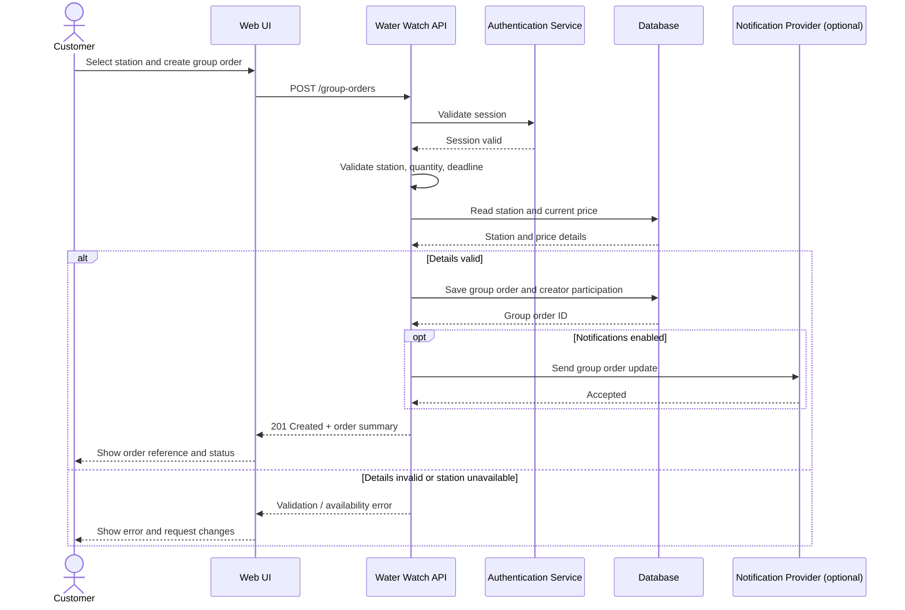

# 5. Sequence Diagram — Customer Creates a Group Order

```mermaid
sequenceDiagram
    actor Customer
    participant UI as Web UI
    participant API as Water Watch API
    participant Auth as Authentication Service
    participant DB as Database
    participant Notify as Notification Provider (optional)

    Customer->>UI: Select station and create group order
    UI->>API: POST /group-orders
    API->>Auth: Validate session
    Auth-->>API: Session valid
    API->>API: Validate station, quantity, deadline
    API->>DB: Read station and current price
    DB-->>API: Station and price details
    alt Details valid
        API->>DB: Save group order and creator participation
        DB-->>API: Group order ID
        opt Notifications enabled
            API->>Notify: Send group order update
            Notify-->>API: Accepted
        end
        API-->>UI: 201 Created + order summary
        UI-->>Customer: Show order reference and status
    else Details invalid or station unavailable
        API-->>UI: Validation / availability error
        UI-->>Customer: Show error and request changes
    end
```
