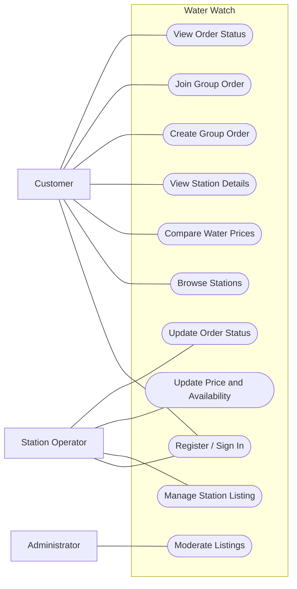

# 3. Use Case Diagram — Water Watch

```mermaid
flowchart LR
    customer[Customer]
    operator[Station Operator]
    admin[Administrator]

    subgraph WW[Water Watch]
      UC1([Register / Sign In])
      UC2([Browse Stations])
      UC3([Compare Water Prices])
      UC4([View Station Details])
      UC5([Create Group Order])
      UC6([Join Group Order])
      UC7([View Order Status])
      UC8([Manage Station Listing])
      UC9([Update Price and Availability])
      UC10([Update Order Status])
      UC11([Moderate Listings])
    end

    customer --- UC1
    customer --- UC2
    customer --- UC3
    customer --- UC4
    customer --- UC5
    customer --- UC6
    customer --- UC7
    operator --- UC1
    operator --- UC8
    operator --- UC9
    operator --- UC10
    admin --- UC11
```
